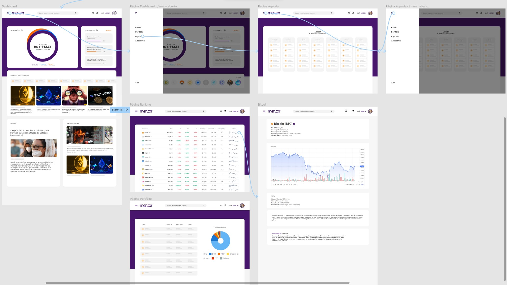
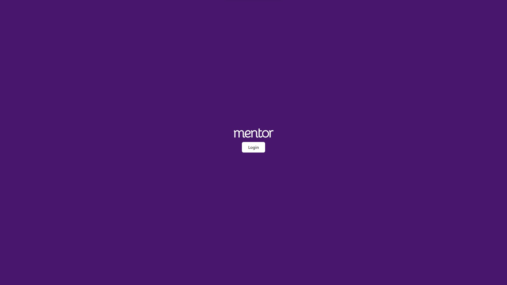
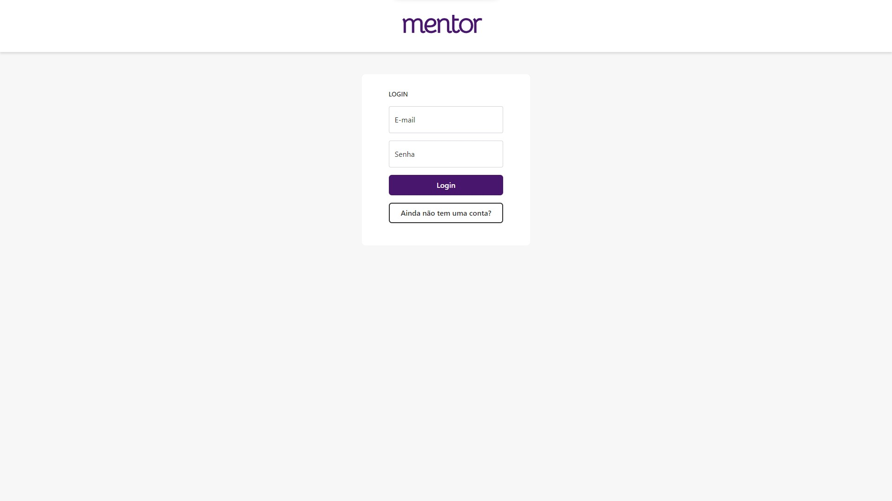
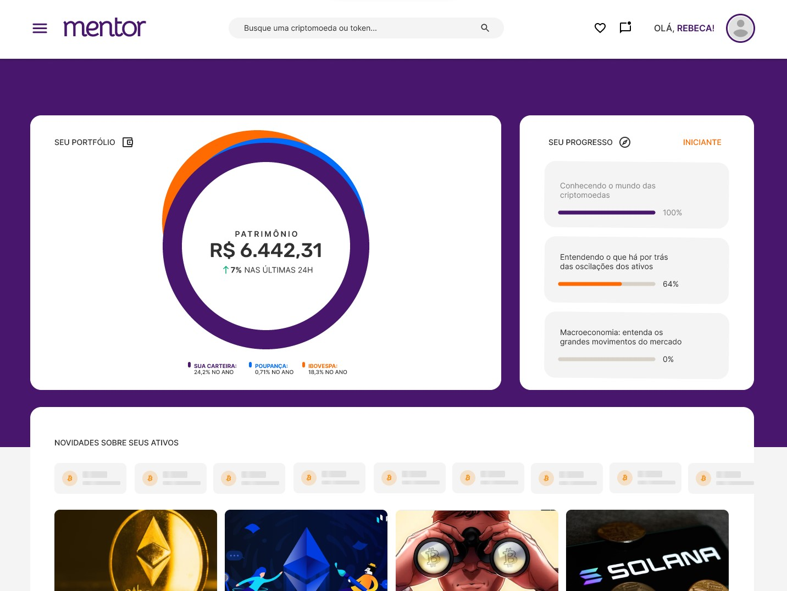
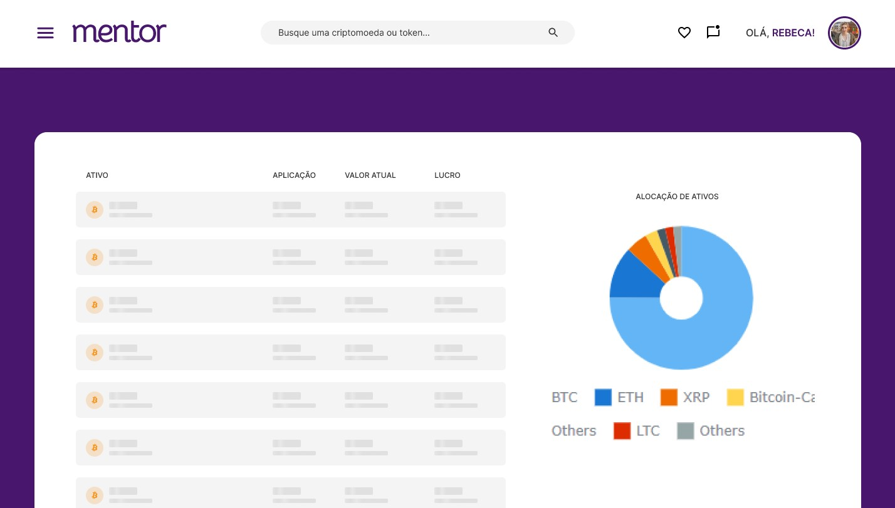
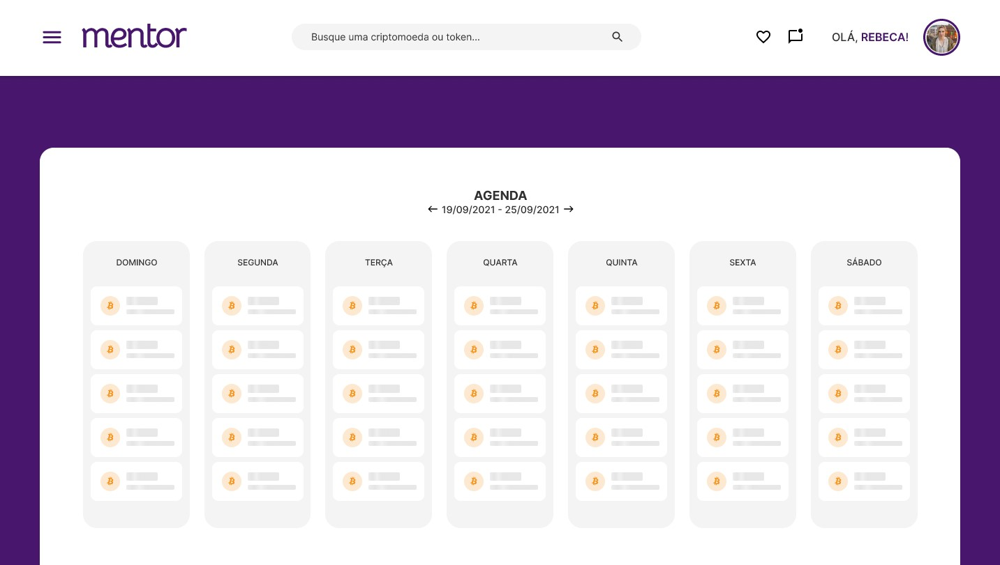
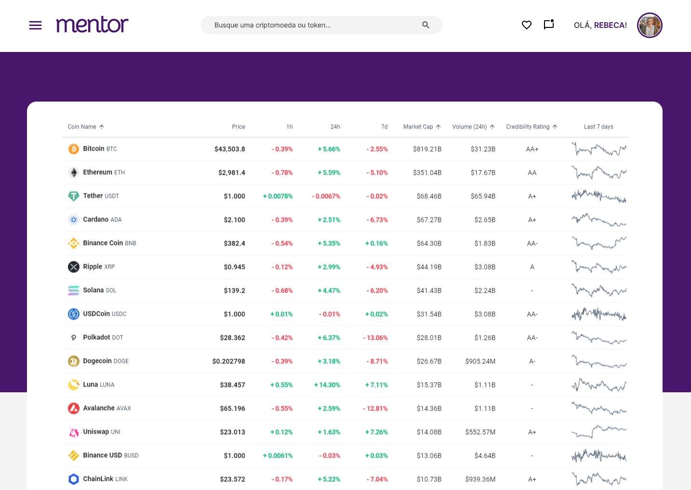
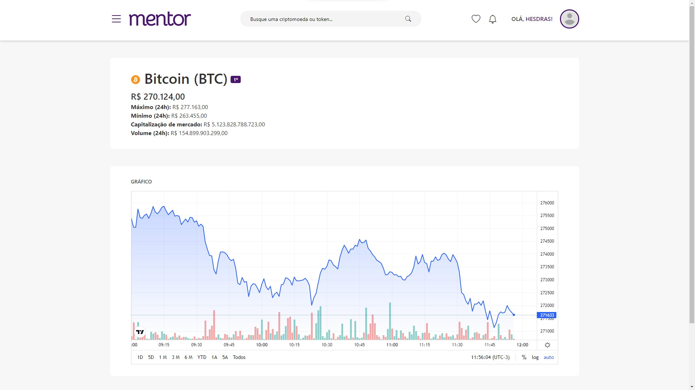

# Projeto de interface
Uma das principais necessidades do projeto é de que a interface transmita confiança ao usuário. Principalmente por conta dos estereótipos em relação ao mercado. Com isso mente, foi desenhada uma interface simples e *clean* para atender esse requisito.

## User flow

## Tela inicial

## Tela de login

## Tela do painel

## Tela de portfólio

## Tela de agenda

## Tela do ranking

## Tela do ativo
