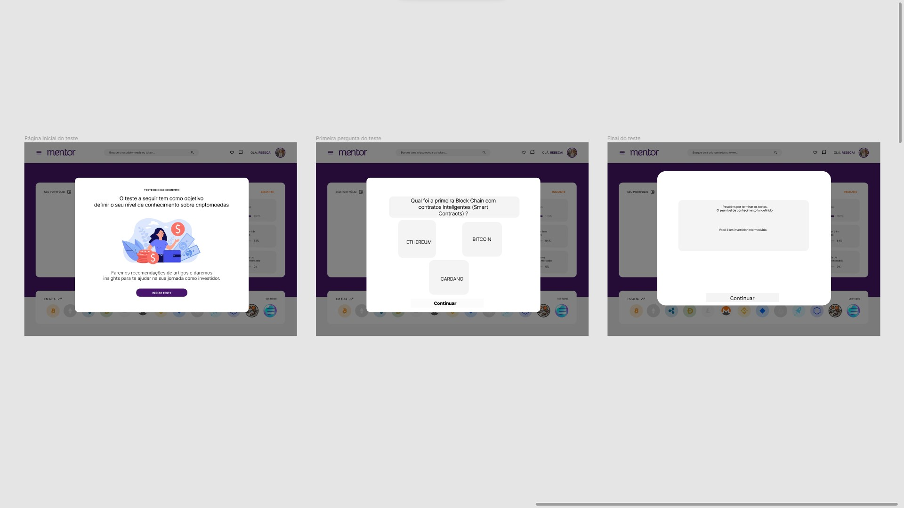

# Projeto da solução

## Tecnologias utilizadas
| TIPO | NOME |
|------|------|
| Linguagem de marcação | HTML |
| Linguagem de estilo | CSS |
| Linguagem de programação | JavaScript |
| Framework | Bootstrap |
| Biblioteca | jQuery |
| API | CoinGecko AwesomeAPI |
| IDE | Visual Studio Code |
| Versionamento de código | Git |
| Controle de versão compartilhado | GitHub |
| Hospedagem | GitHub Pages |

## Arquitetura da solução

Assim que o usuário entra na plataforma, ele é apresentado a um questionário. O objetivo desse processo, é conhecer o usuário e aferir seu nível de conhecimento sobre o mercado.

Depois de respondidas as perguntas, o usuário é redirecionado ao seu painel, onde encontra um *overview* da sua carteira, seu progresso de aprendizagem, eventos e notícias relacionados aos seus investimentos e artigos importantes sobre o mercado.

