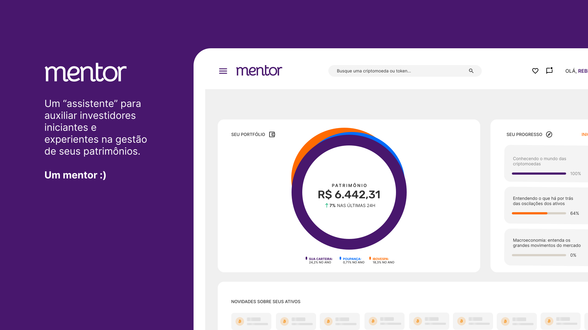

  

  

  

  

  

  <a href="https://classroom.github.com/online_ide?assignment_repo_id=453587&assignment_repo_type=GroupAssignmentRepo">
    

  

# 🧪 Tecnologias

Este projeto foi desenvolvido usando as seguintes tecnologias:

- HTML
- CSS
- JavaScript
